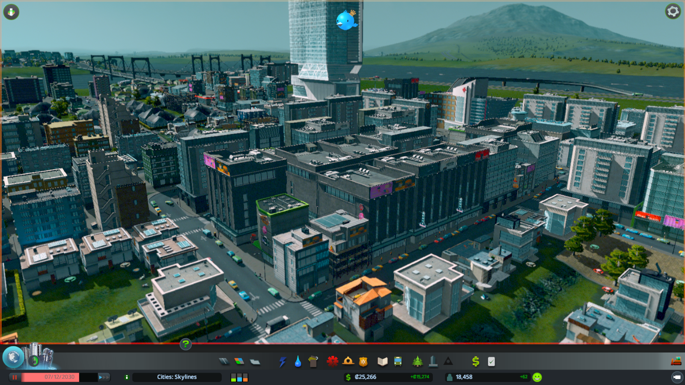
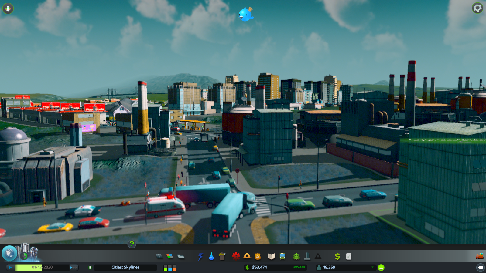
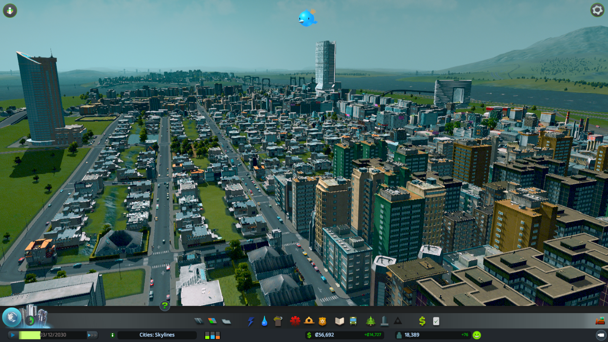

from: <https://forum.paradoxplaza.com/forum/index.php?threads/cities-skylines-dev-diary-7-simulation.828492/>

Hello again! This time we will take a peek at how the game systems actually work. Some of the main goals for us at Colossal Order where to create fun systems which interact with each other, and to have simulated individual citizens.

At the heart of Cities: Skylines is how the individual citizens and goods move around the city. Citizens have a name, age, a home and a workplace, unless they are students at the university or too young to work. Citizens travel to work, go shopping and occasionally visit leisure locations like parks. Not all citizens own cars, so some walk and others drive. If public transportation is available, most of the people without cars will use it for longer trips. Even people with cars use public transportation if they notice driving with their own car might be slower because of the traffic.

Because simulating individual citizens takes some processing power, we opted to cut down the number of citizens. Some residential buildings have a quite low amount of people living in them compared to the size of the building. We felt choosing individual citizens over realistic numbers brought more to the game. So while your high-rise might have only 12 households, everyone has a name and a logical pattern of moving around the city.

Goods are produced in industrial areas and transported to commercial areas to be sold to citizens and tourists. This means that wherever there's a commercial area, there will be trucks driving to and from it. To produce goods, industrial areas use raw materials. If the city produces raw materials by specialized industry, the industry will automatically get them shipped from the specialized production facilities. Industry prefers materials from inside the city, but if none are available, they will order raw materials from outside locations. Materials arriving from outside locations come by truck if no train or cargo ship connections are available, which will put a stress on the road system.

To avoid traffic jams, vehicles choose their route so that they try to avoid busiest spots in the city. They also like to choose lanes early to avoid switching lanes and blocking off two lanes in the process if they are trying to push their way into a line of cars and have to wait. If the traffic does not flow well, there's a traffic info view to show the spots where problems lie. Using roundabouts, elevated roads and building roads to get the vehicles straight to where they are going is are a big part of the game.

Everything is connected. If you build a Fire Station that sends out fire engines to put out fires, the service vehicles can only get to the fires if the roads are not crowded with other vehicles. But just having a Fire Station near by raises the happiness of residential houses. A raise in happiness means the residents are less likely to turn to crime, even if they are unemployed for some time.

Karoliina Korppoo, Colossal Order, lead designer on Cities: Skylines