from: <http://v-e-n-u-e.com/Sim-City-An-Interview-with-Stone-Librande>

In the nearly quarter-century since designer [Will Wright](http://www.nytimes.com/2008/11/23/magazine/23wwln-domains-t.html) launched the iconic urban planning computer game, [_SimCity_](http://en.wikipedia.org/wiki/SimCity), not only has the world's population become [majoritatively urban](http://www.prb.org/Educators/TeachersGuides/HumanPopulation/Urbanization.aspx) for the first time in human history, but interest in cities and their design has gone mainstream.

Once a byword for boring, city planning is now a hot topic, claimed by [technology companies](http://www.guardian.co.uk/smarter-cities/smarter-cities-new-technology-social-improvements), [economists](http://www.nytimes.com/2011/02/13/books/review/Silver-t.html), so-called "[Supermayors](http://urbangenomeproject.org/premise/)," and [cultural institutions](http://www.ted.com/pages/tedx_tedxcity) alike as the key to humanity's future. Indeed, if we are to believe the hype, the city has become our species' [greatest triumph](http://www.amazon.com/gp/product/0143120549/ref=as_li_ss_tl).

A [shot](http://photomichaelwolf.com/#architecture-of-densitiy/4) from photographer Michael Wolf's extraordinary [_Architecture of Density_](http://photomichaelwolf.com/#architecture-of-densitiy/) series, newly [available in hardcover](http://www.amazon.com/gp/product/3941825054/ref=as_li_ss_tl).

In March 2013, the first new iteration of [_SimCity_](http://www.simcity.com) in a decade was [launched](http://www.theverge.com/2012/10/24/3547748/simcity-march-5-US-launch-date), amidst a flurry of [critical praise](http://www.slate.com/articles/technology/technology/2013/03/simcity_review_the_new_version_of_the_classic_game_is_totally_addictive.html) mingled with fan disappointment at Electronic Arts' "always-online" digital rights management policy and repeated server failures.

A few weeks before the launch, **Venue** had the opportunity to play the new [_SimCity_](http://www.simcity.com) at its Manhattan premiere, during which time we feverishly laid out curving roads and parks, drilled for oil while installing a token wind turbine, and tried to ignore our city's residents'--known as Sims--complaints as their homes burned before we could afford to build a fire station.

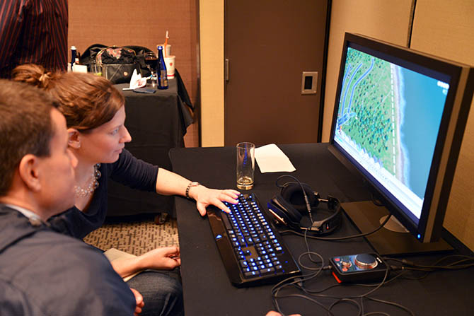

We emerged three hours later, blinking and dazed, into the gleaming white and purple lights of Times Square, and were immediately struck by the abstractions required to translate such a complex, dynamic environment into a coherent game structure, and the assumptions and values embedded in that translation.

Fortunately, the game's lead designer, Stone Librande, was happy to talk with us further about his research and decision-making process, as well as some of the ways in which real-world players have already surprised him. We spoke to him both in person and by telephone, and our conversation appears below.

• • •
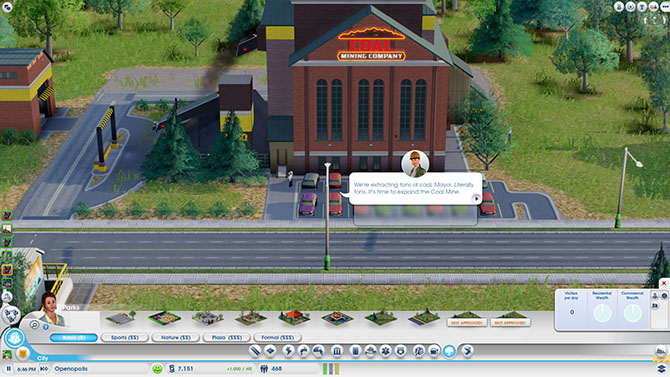

**Nicola Twilley**: I thought I'd start by asking what sorts of sources you used to get ideas for _SimCity_, whether it be reading books, interviewing urban experts, or visiting different cities?

**Stone Librande**: From working on _SimCity_ games in the past, we already have a library here with a lot of city planning books. Those were really good as a reference, but I found, personally, that the thing I was most attracted to was using [Google Earth](http://www.google.com/earth/) and [Google Street View](http://v-e-n-u-e.com/www.google.com/streetview%E2%80%8E) to go anywhere in the world and look down on real cities. I found it to be an extremely powerful way to understand the differences between cities and small towns in different regions.

Google has a tool in there that you can use to measure out how big things are. When I first started out, I used that a lot to investigate different cities. I'd bring up San Francisco and measure the parks and the streets, and then I'd go to my home town and measure it, to figure out how it differed and so on. My inspiration wasn't really drawn from urban planning books; it was more from deconstructing the existing world.

Then I also really got into Netflix streaming documentaries. There is just so much good stuff there, and Netflix is good at suggesting things. That opened up a whole series of documentaries that I would watch almost every night after dinner. There were videos on water problems, oil problems, the food industry, manufacturing, sewage systems, and on and on--all sorts of things. Those covered a lot of different territory and were really enlightening to me.

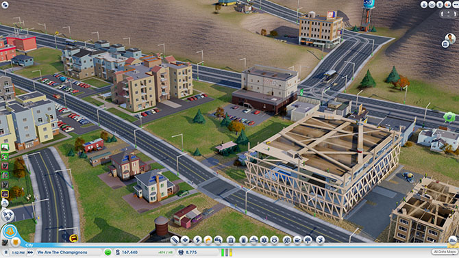

**Geoff Manaugh**: While you were making those measurements of different real-world cities, did you discover any surprising patterns or spatial relationships?

**Librande**: Yes, definitely. I think the biggest one was the parking lots. When I started measuring out our local grocery store, which I don't think of as being that big, I was blown away by how much more space was parking lot rather than actual store. That was kind of a problem, because we were originally just going to model real cities, but we quickly realized there were way too many parking lots in the real world and that our game was going to be really boring if it was proportional in terms of parking lots.

**Manaugh**: You would be making _SimParkingLot_, rather than _SimCity_.

**Librande**: [_laughs_] Exactly. So what we do in the game is that we just imagine they are underground. We do have parking lots in the game, and we do try to scale them--so, if you have a little grocery store, we'll put six or seven parking spots on the side, and, if you have a big convention center or a big pro stadium, they'll have what seem like really big lots--but they're nowhere near what a real grocery store or pro stadium would have. We had to do the best we could do and still make the game look attractive.

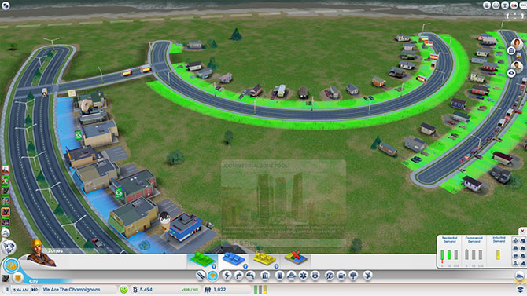
Using the zoning tool for the city designed by We Are the Champignons.

**Twilley**: I'd love to hear more about the design process and how you went about testing different iterations. Did you storyboard narratives for possible cities and urban forms that you might want to include in the game?

**Librande**: The way the game is set up, it's kind of infinite. What I mean by that is that you could play it so many different ways that it's basically impossible to storyboard or have a defined set of narratives for how the player will play it.

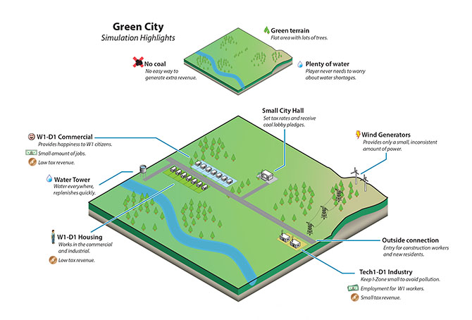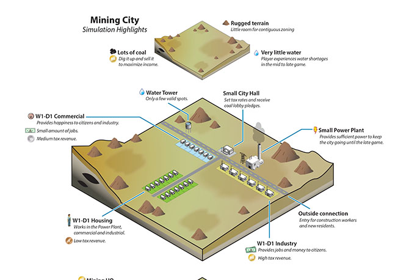
Stone Librande's storyboards for "Green City" and "Mining City" at the start of play.

Instead, what I did was that I came up with two extreme cases--around the office we call them "Berkeley" and "Pittsburgh," or "Green City" and "Dirty City." We said, if you are the kind of player who wants to make utopia--a city with wind power, solar power, lots of education and culture, and everything's beautiful and green and low density--then this would be the path you would take in our game.

But then we made a parallel path for a really greedy player who just wants to make as much money as possible, and is just exploiting or even torturing their Sims. In that scenario, you're not educating them; you're just using them as slave labor to make money for your city. You put coal power plants in, you put dumps everywhere, and you don't care about their health.

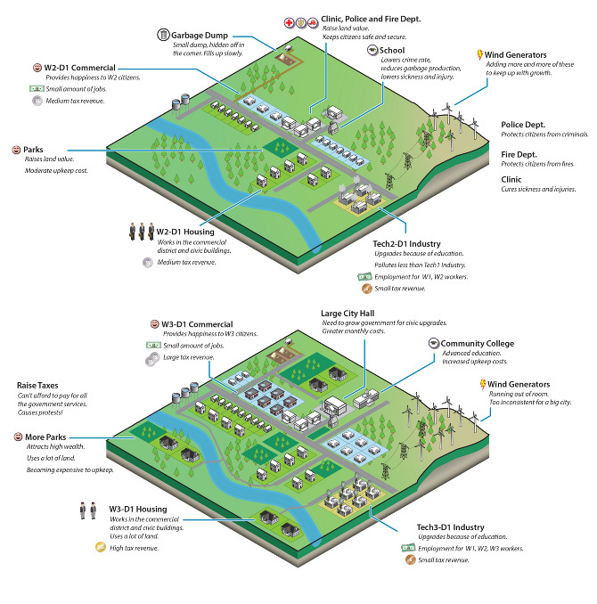
Stone Librande's storyboard for "Green City" at mid-game.

I made a series of panels, showing those two cities from beginning to late stage, where everything falls apart. Then, later on, when we got to multiplayer, I joined those two diagrams together and said, "If both of these cities start working together, then they can actually solve each other's problems."

The idea was to set them up like bookends--these are the extremes of our game. A real player will do a thousand things that fall somewhere in between those extremes and create all sorts of weird combinations. We can't predict all of that.

Basically, we figured that if we set the bookends, then we would at least understand the boundaries of what kind of art we need to build, and what kind of game play experiences we need to design for.

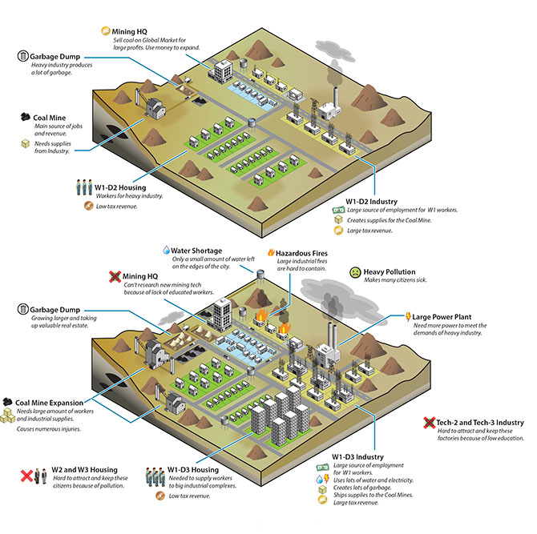
Stone Librande's storyboard for "Mining City" at mid-game.

**Twilley**: In going through that process, did you discover things that you needed to change to make game play more gripping for either the dirty city or the clean city?

**Librande**: It was pretty straightforward to look at Pittsburgh, the dirty city, and understand why it was going to fail, but you have to try to understand why the clean one might fail, as well. If you have one city--one path--that always fails, and one that always succeeds, in a video game, that's really bad design. Each path has to have its own unique problems.

What happened was that we just started to look at the two diagrams side-by-side, and we knew all the systems we wanted to support in our game--things like power, utilities, wealth levels, population numbers, and all that kind of stuff--and we basically divided them up.

We literally said: "Let's put all of this on this side over in Pittsburgh and the rest of it over onto Berkeley." That's why, at the very end, when they join together, they are able to solve each other's problems because, between the two of them, they have all the problems but they also have all the answers.

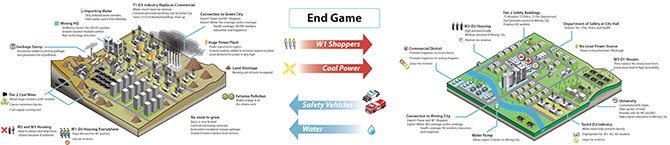
Stone Librande's storyboard for the "Green City" and "Mining City" end-game symbiosis.

**Twilley**: One thing that struck me, after playing, was that you do incorporate a lot of different and complex systems in the game, both physical ones like water, and more abstract ones, like the economy. But--and this seems particularly surprising, given that one of your bookend cities was nicknamed Berkeley--the food system doesn't come into the game at all. Why not?

**Librande**: Food isn't in the game, but it's not that we didn't think about it--it just became a scoping issue. The early design actually did call for agriculture and food systems, but, as part of the natural process of creating a video game, or any situation where you have deadlines and budgets that you have to meet, we had to make the decision that it was going to be one of the things that the Sims take care of on their own, and that the Mayor--that is, the player--has nothing to do with it.

I watched some amazing food system documentaries, though, so it was really kind of sad to not include any of that in the game.

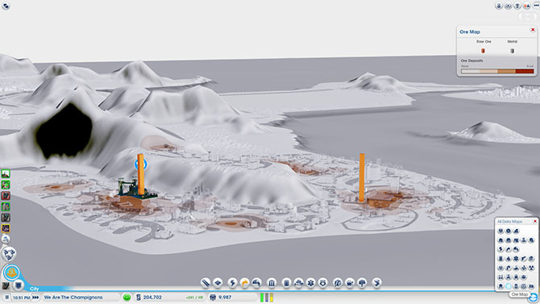
Data layer showing ore deposits.

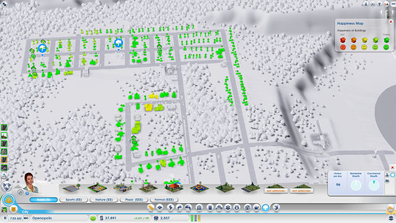
Data layer showing happiness levels. In _SimCity_, happiness is increased by wealth, good road connections, and public safety, and decreased by traffic jams and pollution.

**Manaugh**: Now that the game is out in the world, and because of the central, online hosting of all the games being played right now, I have to imagine that you are building up an incredible archive of all the decisions that different players have made and all the different kind of cities that people have built. I'm curious as to what you might be able to make or do with that kind of information. Are you mining it to see what kinds of mistakes people routinely make, or what sorts of urban forms are most popular? If so, is the audience for that information only in-house, for developing future versions of _SimCity_, or could you imagine sharing it with urban planners or real-life Mayors to offer an insight into popular urbanism?

**Librande**: It's an interesting question. It's hard to answer easily, though, because there are so many different ways players can play the game. The game was designed to cover as many different play patterns as we could think of, because our goal was to try to entertain as many of the different player demographics as we could.

So, there are what we call "hardcore players." Primarily, they want to compete, so we give them leader boards and we give them incentives to show they are "better" than somebody else. We might say: "There's a competition to have the most people in your city." And they are just going to do whatever it takes to cram as many people into a city as possible, to show that they can win. Or there might be a competition to get the most rich people in your city, which requires a different strategy than just having the most people. It's hard to keep rich people in a city.

Each of those leader boards, and each of those challenges, will start to skew those hardcore people to play in different ways. We are putting the carrot out there and saying: "Hey, play this way and see how well you can do." So, in that case, we are kind of tainting the data, because we are giving them a particular direction to go in and a particular goal.

On the other end of the spectrum, there are the "creative players" who are not trying to win--they are trying to tell a story. They are just trying to create something beautiful. For instance, when my wife plays, she wants lots of schools and parks and she's not at all concerned with trying to make the most money or have the most people. She just wants to build that idealized little town that she thinks would be the perfect place to live.

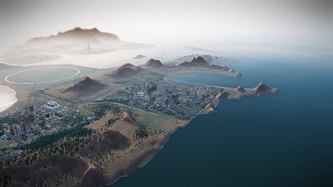
A regional view of a SimCity game, showing different cities and their painfully small footprints.

So, getting back to your question, because player types cover such a big spectrum, it's really hard for us to look at the raw data and pull out things like: "This is the kind of place that people want to live in." That said, we do have a lot of data and we can look at it and see things, like how many people put down a park and how many people put in a tram system. We can measure those things in the aggregate, but I don't think they would say much about real city planning.

**Twilley**: Building on that idea of different sorts of players and ways of playing, are there a variety of ways of "winning" at _SimCity_? Have you personally built cities that you would define as particularly successful within the game, and, if so, what made them "winners"?

**Librande**: For sure, there is no way to win at _SimCity_ other then what you decide to put into the game. If you come in with a certain goal in mind--perhaps, say, that you want a high approval rating and everyone should be happy all the time-- then you would play very differently than if you went in wanting to make a million dollars or have a city with a million people in it.

As far as my personal city planning goes, it has varied. I've played the game so much, because early on I just had to play every system at least once to understand it. I tried to build a power city, a casino city, a mining city--I tried to build one of everything.

Now that I'm done with that phase, and I'm just playing for fun at home, I've learned that I enjoy mid-density cities much more then high-density cities. To me, high-density cities are just a nightmare to run and operate. I don't want to be the mayor of New York; I want to be the mayor of a small town. The job is a lot easier!

Basically, I build in such a way as to not make skyscrapers. At the most, I might have just one or two because they look cool--but that's it.

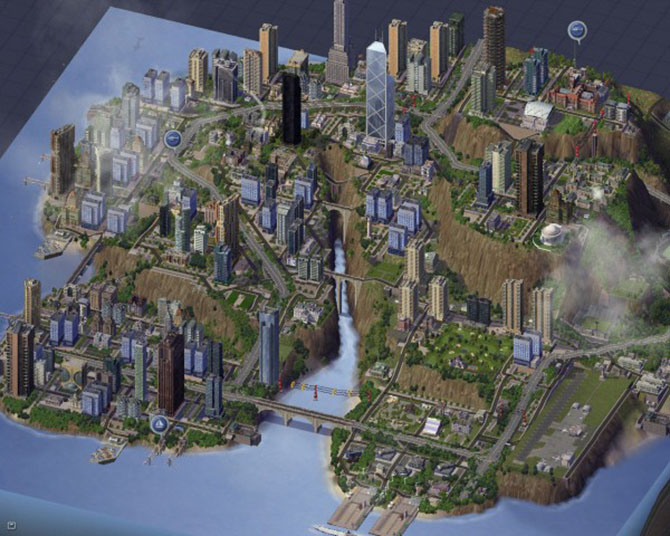
Screenshot from _SimCity 4_.

**Manaugh**: I'm curious how you dealt with previous versions of _SimCity_, and whether there was any anxiety about following that legacy or changing things. What are the major innovations or changes in this version of the game, and what kinds of things did you think were too iconic to get rid of?

**Librande**: First of all, when we started the project, and there were just a few people on the team, we all agreed that we didn't want this game to be called _SimCity 5_. We just wanted to call it _SimCity_, because if we had a _5_ on the box, everybody would think it had to be _SimCity 4_ with more stuff thrown in. That had the potential to be quite alienating, because _SimCity 4_ was already too complicated for a lot of people. That was the feedback we had gotten.

Once we made that title decision, it was very liberating--we felt like, "OK, now we can reimagine what the brand might be and how cities are built, almost from scratch."

Technically, the big difference is the "GlassBox" engine that we have, in which all the agents promote a bottom-up simulation. All the previous _SimCity_ games were literally built on spreadsheets where you would type a number into a grid cell, and then it propagated out into adjacent grid cells, and the whole city was a formula.

_SimCity 4_ was literally prototyped in Excel. There were no graphics--it was just a bunch of numbers--but you could type a code that represented a particular type of building and the formulae built into the spreadsheet would then decide how much power it had and how many people would work there. It just statically calculated the city as if it were a bunch of snapshots.

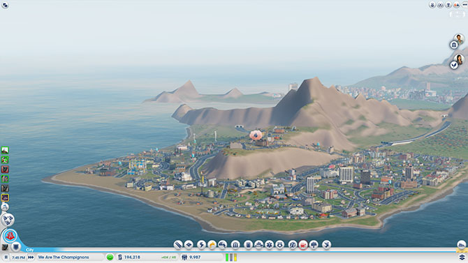
A fire breaks out in the city designed by We Are The Champignons.

Because our _SimCity_--the new _SimCity_--is really about getting these agents to move around, it's much more about flows. Things have to be in motion. I can't look at anybody's city as a screenshot and tell you what's going on; I have to see it live and moving before I can fully understand if your roads are OK, if your power is flowing, if your water is flowing, if your sewage is getting dumped out, if your garbage is getting picked up, and so on. All that stuff depends on trucks actually getting to the garbage cans, for example, and there's no way to tell that through a snapshot.

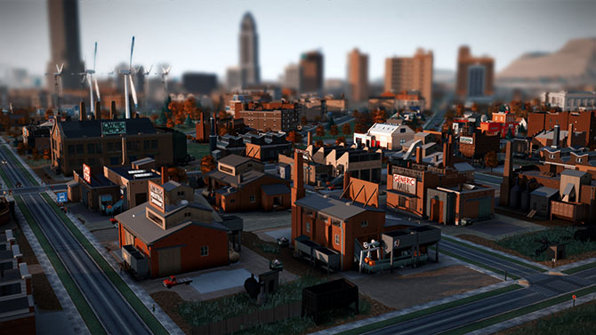
Sims queue for the bus at dawn.

Once we made that decision--to go with an agent-driven simulation and make it work from the bottom up--then all the design has to work around that. The largest part of the design work was to say: "Now that we know agents are going to run this, how do schools work with those agents? How do fire and police systems work with these agents? How do time systems work?" All the previous editions of _SimCity_ never had to deal with that question--they could just make a little table of crimes per capita and run those equations.

**Manaugh**: When you turned things over to the agents, did that have any kind of spatial effect on game play that you weren't expecting?

**Librande**: It had an effect, but it was one that we were expecting. Because everything has to be in motion, we had to have good calculations about how distance and time are tied together. We had to do a lot of measurements about how long it would really take for one guy to walk from one side of the city to the other, in real time, and then what that should be in game time--including how fast the cars needed to move in relationship to the people walking in order to make it look right, compared to how fast would they really be moving, both in game time and real time. We had all these issues where the cars would be moving at eighty miles an hour in real time, but they looked really slow in the game, or where the people were walking way, way too fast, but actually they were only walking at two miles an hour.

We knew this would happen, but we just had to tweak the real-life metrics so that the motion and flow look real in the game. We worked with the animators, and followed our intuition, and tried to mimic the motion and flow of crowds.

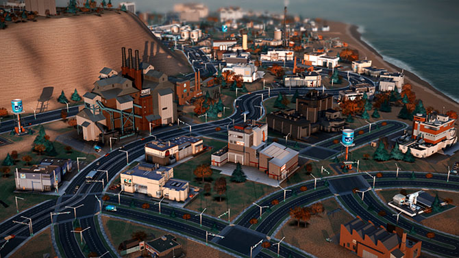
We Are The Champignons' industrial zone, carefully positioned downwind of the residential areas.

In the end, it's not one hundred percent based on real-life metrics; it just has to look like real life, and that's true throughout the game. For example, if we made the airport runways actual size, they would cover up the entire city. Those are the kinds of things where we just had to make a compromise and hope that it looked good.

**Twilley**: Actually, one of the questions we wanted to ask was about time in the game. I found it quite intriguing that there are different speeds that you can choose to play at, but then there's also a distinct sense of the phases of building a city and how many days and nights have to pass for certain changes to occur. Did you do any research into how fast cities change and even how the pace of city life is different in different places?

**Librande**: We found an amazing article about [walking speeds in different cities](http://www.newscientist.com/blog/shortsharpscience/2007/05/quickstep-world-is-walking-faster.html). That was something I found really interesting. In cities like New York, people walk faster, and in medium-sized or small towns, they walk a lot slower. At one point, we had Sims walking faster as the city gets bigger, but we didn't take it that far in the final version.

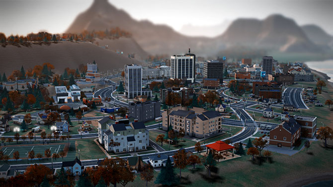

I know what you are talking about, though: in the game, bigger cities feel a lot busier and faster moving. But there's nothing really built into the game to do that; it's just the cumulative effect of more moving parts, I guess. In kind of a counter-intuitive way, when you start getting big traffic jams, it feels like a bigger, busier city even though nothing is moving--it's just to do with the way we imagine rush-hour gridlock as being a characteristic of a really big city.

The fact that there's even a real rush hour shows how important timing is for an agent-based game. We spent a lot of time trying to make the game clock tick, to pull you forward into the experience. In previous _SimCities_, the day/night cycle was just a graphical effect--you could actually turn it off if you didn't like it, and it had no effect on the simulation. In our game, there is a rush hour in the morning and one at night, there are school hours, and there are shopping hours. Factories are open twenty-four hours a day, but stores close down at night, so different agents are all working on different schedules.

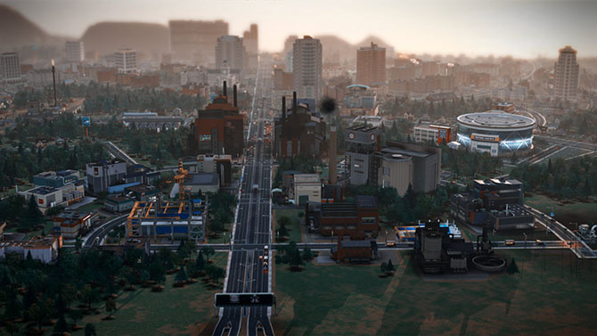

The result is that you end up getting really interesting cycles--these flows of Sims build up at certain times and then the buses and streets are empty and then they build back up again. There's something really hypnotic about that when you play the game. I find myself not doing anything but just watching in this mesmerized state--almost hypnotized--where I just want to watch people drive and move around in these flows. At that point, you're not looking at any one person; you're looking at the aggregate of them all. It's like watching waves flow back and forth like on a beach.

For me, that's one of the most compelling aspects of our game. The timing just pulls you forward. We hear this all the time--people will say, "I sat down to play, and three hours had passed, and I thought, wait, how did that happen?" Part of that is the flow that comes from focusing, but another part of it is the success of our game in pulling you into its time frame and away from the real-world time frame of your desk.

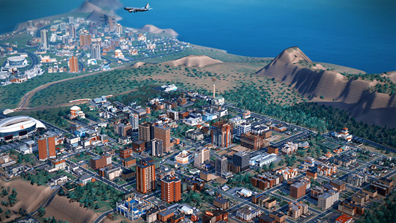

**Twilley**: Has anything about the way people play or respond to the game surprised you? Is there anything that you already want to change?

**Librande**: One thing that amazed me is that, even with the [issues at the launch](http://www.theverge.com/2013/5/8/4311780/original-simcity-creator-will-wright-calls-ea-botched-launch-inexcusable), we had the equivalent of nine hundred man-years put into _SimCity_ in less than a week.

Most of the stuff that people are doing, we had hoped or predicted would happen. For example, I anticipated a lot of the story-telling and a lot of the creativity--people making movies in the cities, and so on--and we're already seeing that. [YouTube](http://www.youtube.com/user/SimCityEA) is already filled with how-to videos and people putting up all these filters, like [film noir citie](http://www.youtube.com/watch)s, and it's just really beautiful.

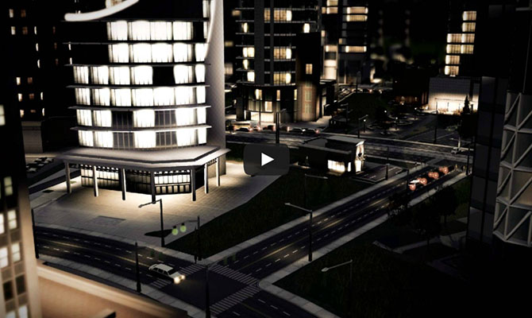
Screen shot from _SimCity_ player Calvin Chan's film noir [montage](http://www.youtube.com/watch) of his city at night.

The thing I didn't predict was that, in the first week, two [_StarCraft_](http://www.youtube.com/user/starcraft) players--that's a very fast-paced space action game, in case you're not familiar with it, and it's fairly common for hardcore players to stream their _StarCraft_ battles out to a big audience--decided to have a live-streamed _SimCity_ battle against each other. They were in a race to be the first to a population of 100,000; they live-streamed their game; and there were twenty thousand people in the chat room, cheering them on and typing in advice--things like "No, don't build there!" and " What are you doing--why are you putting down street cars?" and "Come on, dude, turn your oil up!" It was like that, nonstop, for three hours. It was like a spectator sport, with twenty thousand people cheering their favorite on, and, basically, backseat city planning. That really took me by surprise.

I'm not sure where we are going to go with that, though, because we're not really an [eSport](http://en.wikipedia.org/wiki/Electronic_sports), but it seems like the game has the ability to pull that out of people. I started to try to analyze what's going on there, and it seems that if you watch people play _StarCraft_ and you don't know a lot about it, your response is going to be something like, "I don't know what I'm looking at; I don't know if I should be cheering now; and I don't know if what I just saw was exciting or not."

But, if you watch someone build a city, you just know. I mean, I don't have to teach you that putting a garbage dump next to people's houses is going to piss them off or that you need to dump sewage somewhere. I think the reason that the audience got so into it is that everyone intuitively knows the rules of the game when it comes to cities.