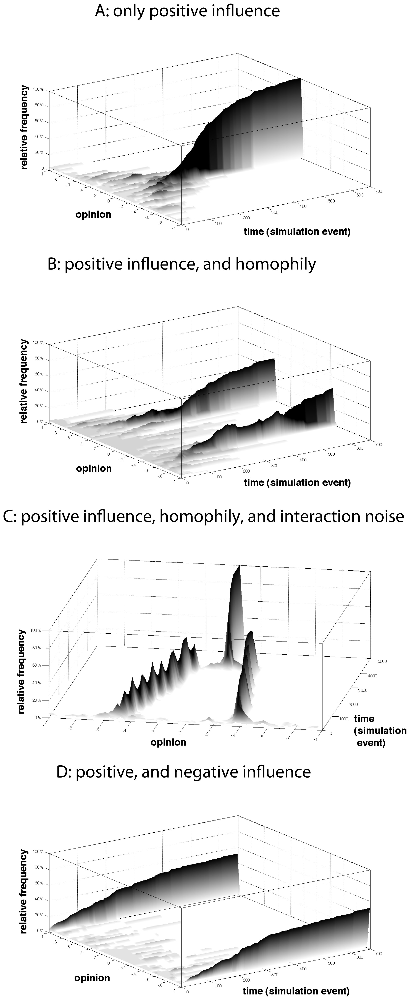
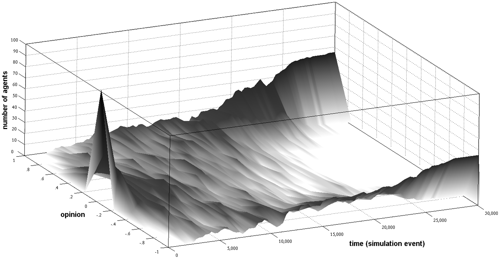

# Macy, M. W., Kitts, J. A., Flache, A., & Benard, S. (2003). Polarization in dynamic networks: A Hopfield model of emergent structure. Dynamic social network modeling and analysis, 162-173.

- "xenophobia" as the negative valence of "homophily"
    - "homophily" has two components: attraction (drawn towards similar agents) and social influence (become more like nearby agents)
- "differentiation" is the opposite of "imitation"

Hopfield model:

- each agent has $N-1$ undirected ties to other agents
- weights between agents $i$ and $j$ is $w_{ij}, -1.0 < w_{ij} < 1.0$
- social pressure $P_{is}, -1 < P_{is} < 1$ for agent $i$ to adopt binary state $s, s = \pm 1$:

$$
P_{is} = \frac{\sum_{j=1}^N w_{ij} s_j}{N-1}, j \neq i
$$

> social pressure...to adopt $s$ becomes increasingly positive as $i$'s "friends" adopt $s$ ($s=1$) and $i$'s "enemies" reject $s$ ($s=-1$).

> ...social pressure does not guarantee that an agent will accommodate, however. It is effective only if $i$ is willing and able to respond to peer influence. If $i$ is closed-minded or if a given trait is not under $i$'s control (e.g., ethnicity or gender), then no change to $s$ will occur.

- $v, 0 \leq v \leq 1$ specifies if a state is fixed ($v=0$) or free ($v=1$).
- $X$ represents an exogenous determination of $s$

The probability $\pi_{is}$ of $i$ adopting state $s$ is:

$$
\pi_{is} = \frac{v_s}{1 + e^{-10P_{is}}} + (1-v_s) X_i
$$

Agent $i$ adopts $s$ if $\pi > 0.5 \pm \chi \epsilon$, where $\chi$ is a random number $0 < \chi < 0.5$ and $\epsilon, 0 \leq \epsilon \leq 1$ is an exogenous error parameter; if $\epsilon = 0$ we get deterministic behavior.

Weights $w_{ij}$ start uniformly random. They must be symmetric $w_{ij} = w_{ji}$.

For $K$ state variables, the weights update like so:

$$
w_{ij, t+1} = w_{ijt} (1 - \lambda) + \frac{\lambda}{K} \sum_{k=1}^K s_{jkt} s_{ikt}, j \neq i
$$

The parameter $0 < \lambda < 1$ defines the rate of learning.

---

# Mäs M, Flache A (2013) Differentiation without Distancing. Explaining Bi-Polarization of Opinions without Negative Influence. PLoS ONE 8(11): e74516. doi:10.1371/journal.pone.0074516

Although "negative influence" can explain bi-polarization in modeling, there is mixed empirical support for it as the primary mechanism for bi-polarization (that is, it does not seem that people actively seek to increase disagreement with people they dislike).

> empirical tests have hitherto not provided unequivocal evidence in support of the negative-influence assumption. In laboratory experiments, researchers typically informed participants about the opinions of members of fictitious in- and outgroups and then measured pre-test-post-test opinion shifts [32]. The underlying assumption in this line of work was that ingroup members are seen as positive source of influence, while opinions of outgroup members should exert negative influence. These studies have led to mixed results. Many did not find support for negative influence [14], [32], [61]. In addition, research illustrates that individuals may publicly distance themselves from others but their private opinions actually do not shift [62].
>
> Moreover, methodological issues cast doubt on the conclusiveness of those studies that researchers interpreted as support for negative influence [14], [63]–[68]. Krizan and Baron [32] raised a number of issues with regard to experiments that focus on negative influence by members of outgroups. For instance, the authors criticize that oftentimes experimental settings do not explicitly refer to a particular outgroup and, thus, do not specify the point of reference for negative influence [69], making it difficult to attribute observed opinion changes to the motivation to intensify differences to outgroups. In addition, a typical strategy adopted in, e.g., experiments based on the minimal group paradigm [70] is to assign participants to temporary groups, “raising questions regarding whether any significant feelings of group identification develop” [32].

The "argument-communication theory of bi-polarization" (ACTB) explains bi-polarization without negative influence.

Graphic demonstrating simulations with various mechanisms:

The z-axis (also depicted as the shading) demonstrates relative frequency of that opinion.

In A (just positive influence), you can see that 100% of the population converges on the same opinion.
In B (positive influence + homophily), two opinions come to dominate.
In C (positive influence + homophily + interaction noise, e.g. not strict homophily; people can sometimes be influenced by those different than them), one opinion comes to dominate eventually. Since this is not what we see in the world, there is probably another mechanism in addition to homophily.
In D (positive + negative influence), bi-polarization occurs.

also:

> Modelers have studied homophily also on the level of socio-demographic attributes, including the assumption that similarity on demographic variables motivates interaction and social influence [2], [55]. Socio-demographic characteristics are fixed or change at a very slow rate, creating a cleavage along which opinion differences between demographic groups can evolve and intensify. However, socio-demographic cleavages are weak when homophily is based on multiple demographic characteristics that are not perfectly aligned [56], [57]. Accordingly, social-influence models predict that opinion clusters can form in the short term [2] but will eventually converge when socio-demographic attributes are not perfectly correlated [55].

(the paper offers more specifics)

> The core ingredient that ACTB adds to existing approaches to social influence is the communication of arguments. Abstracting from arguments, existing social-influence models assume that individuals inform each other about their opinions during interaction, a process which modelers typically implemented as opinion averaging [17], [18], [23], [24], [48], [49]. On the one hand, averaging appears to be a realistic operationalization of social influence when individuals with different opinions influence each other, because it implies decreasing opinion differences. On the other hand, averaging implies that individuals do not adjust their opinions when they interact with others with whom they already agree, because the average of two identical values is similar to these values. In clear contrast, social psychological [75] and sociological [82] research on the opinion dynamics in discussion groups suggests that through the communication of arguments interaction partners with similar opinions can provide each other with new arguments which reinforce their initial opinion and, thus, leads to intensified views that may be more extreme than those of any of the participants were prior to the interaction [75], [78].

So ACTB is based on research that people who share the same opinion, after conversing, may both end up intensifying that opinion further than either held it previously (this is based on Persuasive Argument Theory, PAT).

- each agent $i$ has an opinion $o_{i,t}, -1 \leq o_{i,t} \leq 1$ at time $t$
- there are $P$ pro arguments ($a_l=1$) and $C$ con arguments ($a_l=-1$) represented as an argument vector
- empirically, people have limited capacities to remember and process information, so only a subset $S_{i,t}$ of _relevant_ arguments (relevant if $r_{i,t,l} = 1$, irrelevant if $r_{i,t,l} = 0$; these are values in $S_{i,t}$) are used to compute agent $i$'s opinion:

$$
o_{i,t} = \frac{1}{S_{i,t}} \sum_{l=1}^{S_{i,t}} a_l r_{i,t,l}
$$

- from research on memory processes and existing models of social influence: agents disregard pieces of information that have not been communicated in recent interactions; this is represented as a _recency_ vector which has the same structure as the argument vector. Each position is a recency ranking for that argument (we only consider relevant arguments). A recency ranking of 0 means the argument is not sufficiently recent and thus it is not considered in the opinion update. The most recent argument has a value of $s_{l,i,t} = S_{i,t}$ and the next most recent argument has the value of $S_{i,t}-1$ and so on.
- the probability that agents $i$ and $j$, where $i \neq j$, are chosen for interaction is dependent on their similarity:

$$
sim_{i,j,t} = \frac{1}{2} (2 - |o_{i,t} - o_{j,t}|)
$$

Where $sim_{i,j,t}=1$ if they have exactly the same opinion and 0 for maximum dissimilarity.

- the actual probability of interacting then is:

$$
p_{j,t} = \frac{(sim_{i,j,t})^h}{\sum_{p=1,p \neq i}^{N-1} (sim_{i,p,t})^h
$$

where the parameter $h$ is the strength of homophily.

- when two agents $i$ and $j$ interact, one argument $a_l$ is uniformly randomly chosen from the $S_{j,t}$ relevant arguments for $j$. The chosen argument is adopted by $i$ (its recency for $i$ is updated to $S_{i,t}+1$), then all arguments of non-zero recency that were previously more recent to $a_l$ are reduced by 1.

An example run in which bi-polarization results (although under some conditions perfect consensus can still be achieved):

---

# Bednar, J., Bramson, A., Jones-Rooy, A., & Page, S. (2010). Emergent cultural signatures and persistent diversity: A model of conformity and consistency. Rationality and Society, 22(4), 407-444.

- $N$ agents, each represented by a vector of $M$ elements that take one of $A$ values
    - if for agent $j$ attribute $a_i^j = a_k^j$ they are _consistent_ ($a_i^j$ refers to the $i$th attribute for agent $j$)
- agents strive for internal consistency. $s(a^j)$, the _consistency payoff function_, is the number of times the most common attribute appears in agent $j$'s attribute vector:

$$
s(a^j) = \max_{a \in A} \{|i| : a_i^j = a\}
$$

- force 1: agents can perceive internal inconsistency; this model proposes an _internal consistency rule_ where the agent takes two random distinct attributes and changes the value of the first to match the value of the second.
- agents also experience pressure/desire to socially conform/coordinate with a payoff (the _conformity payoff function_):

$$
f(a^j a^{-j}) = \frac{\sum_{k \neq j} \sum_{i=1}^M \delta (a_i^j, a_i^k)}{NM}
$$

where $\delta(a_i^j, a_i^k) = 1$ if and only if $a_i^j = a_i^k$

- force 2: the _social conformity rule_: the first paired agent randomly chooses an attribute and sets the value of that attribute equal to the value that the other agent assigns to that attribute
- these two forces can be combined into the _consistent conformity model_ with a combined payoff function, where $\alpha \in [0,1]$:

$$
\pi_j(a^j, a^{-j}) = \alpha s(a^j) + (1-\alpha)f(a^j, a^{-j})
$$

- in this combined model: with probability $p$ the activated agent applies the internal consistency rule and with probability $1-p$ it applies the social conformity rule

---

# Amblard, F., & Deffuant, G. (2004). The role of network topology on extremism propagation with the relative agreement opinion dynamics. Physica A: Statistical Mechanics and its Applications, 343, 725-738.

- $N$ agents
- each agent $i$ has two variables, both real numbers
    - an opinion $x_i$
    - an uncertainty $u_i$
- a segment $s_i = [x_i - u_i, x_i + u_i]$ of the opinion axis is the _opinion segment_ of agent $i$
- "bounded confidence" in their opinion: an agent $j$ can influence agent $i$ when its opinion is inside $s_i$
- the Relative Agreement model:
    - the intensity of the influence depends on the agent $j$ uncertainty $u_j$
    - the agreement of agent $i$ with agent $j$ (agreement is non-symmetric) is the overlap $h_{ij}$ of the opinion segments $s_i$ and $s_j$ minus the non-overlap, $2 u_i - h_{ij}$

$$
h_{ij} = \min(x_i + u_i, x_j + u_j) - \max(x_i - u_i, x_j - u_j)
$$

so the agreement is:

$$
h_{ij} - (2 u_i - h_{ij}) = 2(h_{ij} - u_i)
$$

the _relative agreement_ is the agreement divided by the length of the segment $s_i$:

$$
\frac{2(h_{ij} - u_i)}{2 u_i} = \frac{h_{ij}}{u_i} - 1
$$

If $h_{ij} > u_i$ then the modifications of $x_j$ and $u_j$ by interaction with $i$ are multiplied by the relative agreement:

$$
\begin{aligned}
x_j &:= x_j + \mu (\frac{h_{ij}}{u_i} - 1)(x_i - x_j) \\
u_j &:= u_j + \mu (\frac{h_{ij}}{u_i} - 1)(u_i - u_j)
\end{aligned}
$$

where $\mu$ is the rate of dynamics.

If $h_{ij} \leq u_i$ then there is no influence of $i$ on $j$.

So agents influence each other's opinions _and_ uncertainties, and in an asymmetric way (depends on each agent's uncertainty).

The authors also introduce _extremists_ who have opinions at the extreme end of the spectrum and very high confidences (low uncertainty).

---

# Baldassarri, D., & Bearman, P. (2007). Dynamics of political polarization. American sociological review, 72(5), 784-811.

People who are similar may not necessarily be drawn to each other _because_ they are similar, but because being similar causes them to frequent similar places, which means they are more likely to encounter each other.

- this model incorporates an _interest_ level for opinions (0 = no interest)
- also distinguishes _real_ ideological distance from _perceived_ ideological distance
    - when they interact, the latter is updated to the former
- discussions/interactions between agents focus on those they share strong interest in (even if they have polar opinions on it)
    - the relevant issue for discussion is the issue for which the absolute sum of their interests is maximal
    - in this way, if one agent has a strong enough interest but the other agent does not have much an interest, they still may discuss that issue because of the former agent's powerful interest
- change in opinion is sensitive to their level of interest (magnitude of change decreases as their absolute interest increases):

$$
\Delta a_i^{(t)} = \mu \frac{||a_t^{(t)}| - |b_i^{(t)}||}{|a_i^{(t)}|}
$$

for $a_i^{(t)} \neq 0$ and where $\mu$ is a scaling factor that restricts the range of attitude change for a single interaction.